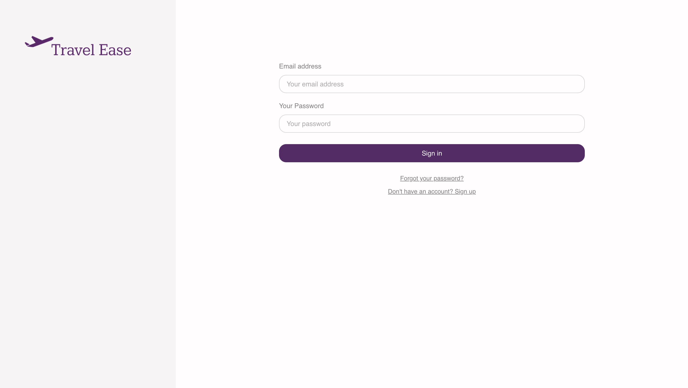

# TravelEase

TravelEase is a React-based web application designed to help users share and manage their travel itineraries. The platform includes user authentication, post creation, updates, deletion, an interactive home feed with various features for enhanced user interaction and AI generated itneraries.

## Table of Contents
- [Features](#features)
- [Technologies Used](#technologies-used)
- [Demo](#heres-how-travelease-looks)
- [Getting Started](#getting-started)
## Features

- **User Authentication**: Sign-in and signup functionality.
- **Post Management**: Create, update, and delete travel itinerary posts.
- **Interactive Home Feed**: 
  - Like and comment on posts
  - Sort posts by time
  - Search posts by title
- **AI generated itneraries**: Creates travel itneraries based on user's preferences.
- **Backend Management**: Utilizes PostgreSQL for data handling and scalability.

## Technologies Used

- **Frontend**: React
- **Design**: Figma
- **Backend**: PostgreSQL(supabase), Openai Api

# Here's how TravelEase looks
<a href="https://www.figma.com/design/Dr1w7mHOvZfxOw1Dd4RxTo/Untitled?node-id=0-1&t=9emaJbgFH2z1Tw22-1">
  <p> TravelEase Figma Design File - Click here!</p>
</a>

<a href="https://travelease1.netlify.app/">
  <p> TravelEase Website - Click here!</p>
</a>

<a href="https://travelease1.netlify.app/">
    
</a>


# Getting started

1. **Clone the repository**:
   ```bash
   git clone https://github.com/ileana-aguilar/TravelEaseAI.git
   cd travelease

3. **Create a supabase account**
   - add your api key to client.js
   
5. **Install dependencies**
```
npm install
```

**Run the application in developer mode**

```
npm run dev
```

**Open project in the browser**

In the command line Vite will display a link, such as http://127.0.0.1:5173 to click on or copy/paste that will take you to the localhost port where the project is running.

**Tip:** If you'd like to stop the server, you can use ctrl + c or cmd + c within the Terminal, or use the trash can icon in the top right of the Terminal within VS Code. To run the server again, simply use npm run dev again.
